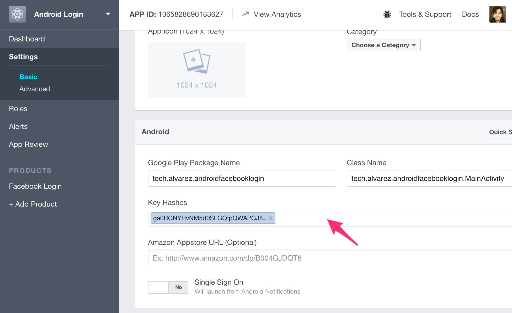

Implementarás un inicio de sesión (Log In) con Facebook en una aplicación Android. Además de obtener la información del usuario y mostrarla.

[YouTube](https://www.youtube.com/watch?v=1HgM_vc-rSc)

> Actualizado, además de seguir el proceso del video, tiene el código completo de la versión para obtener la información del usuario y el correo usando Graph API de Facebook.

### Aprenderás
* Autenticarte con Facebook en tu aplicación Android
* Obtener la información del perfil del usuario, nombre, URL de la foto, entre otros.
* Solicitar y mostrar información adicional que requiere permiso como el correo electrónico.

### Requisitos
* Configurar el SDK de Facebook en tu aplicación Android.
* Una cuenta Facebook

## 1. Implementación

### LoginButton

```xml
<com.facebook.login.widget.LoginButton
        android:id="@+id/loginButton"
        android:layout_width="wrap_content"
        android:layout_height="wrap_content"
        />
```

### CallBackManager

Definición como variable global.

```java
private CallbackManager callbackManager;
```

En el método `onCreate()`

```java
callbackManager = CallbackManager.Factory.create();
```

#### Método generado

```java
@Override
protected void onActivityResult(int requestCode, int resultCode, Intent data) {
    super.onActivityResult(requestCode, resultCode, data);
    callbackManager.onActivityResult(requestCode, resultCode, data);
}
```

#### Manejo de eventos

```java
loginButton.registerCallback(callbackManager, new FacebookCallback<LoginResult>() {
    @Override
    public void onSuccess(LoginResult loginResult) {

    }

    @Override
    public void onCancel() {

    }

    @Override
    public void onError(FacebookException error) {

    }
});
```

Luego de ver como se implementan estos métodos en el video, puedes seguir con los siguiente pasos donde además obtenemos la información del usuario y realizamos peticiones al *Graph API* para obtener el correo electrónico. Al final incluimos el código completo de todas las versiones.

## 2. Invalid key hash

Si estas en modo desarrollo y quieres probar el inicio de sesión en un dispositivo físico es posible que tengas o te aparezca el siguiente error:


### Solución

Simplemente lo que debes de hacer (permaneciendo en modo desarrollo) es adicionar ese "Key hash" mostrado en el error a la página de la aplicación en Facebook.



Y así puedes adicionar cuantos quieras uno después de otro, esto solo se hace en modo desarrollo y cuando este en producción naturalmente se podrá autenticar desde cualquier dispositivo.

## 3. Información del usuario

> Este proceso no se muestra en el video pero se encuentra detallado con el código completo a continuación.

Una vez el Login sea exitoso se puede obtener la información del perfil del usuario de la siguiente forma. Adicionamos código en el caso de que `getCurrentAccessToken()` no sea `null` y obtenemos el `Profile` actual.

```java
if (AccessToken.getCurrentAccessToken() == null) {
    goLoginScreen();
} else {
    Profile profile = Profile.getCurrentProfile();
    if (profile != null) {
        displayProfileInfo(profile);
    } else {
        Profile.fetchProfileForCurrentAccessToken();
    }
}
```

En el caso de que obtengamos sin problemas nos creamos el método `displayProfileInfo` que sería el siguiente:

```java
private void displayProfileInfo(Profile profile) {
    String id = profile.getId();
    String name = profile.getName();
    String photoUrl = profile.getProfilePictureUri(100, 100).toString();

    nameTextView.setText(name);
    idTextView.setText(id);

    Glide.with(getApplicationContext())
            .load(photoUrl)
            .into(photoImageView);
}
```

Como puedes notarlo de `profile` podemos obtener el `id`, `name`, la URL de la foto de perfil, entre otras cosas, puedes ver el listado completo en la documentación de Profile.

> Para descargar la foto desde la URL a un `ImageView` usamos Glide, puedes ver el lab completo de como usarlo (con video disponible) en este website.

### ProfileTracker

En el caso de que el `profile` sea `null` hay que solicitar que se encuentre el perfil actual, eso se hace creando este `ProfileTracker`, y es así como se gestiona. Como variable global de `MainActivity.java`.

````java
private ProfileTracker profileTracker;
````

En el `onCreate()`, en donde si lo encontramos usamos el mismo método para mostrar creado anteriormente.

```java
profileTracker = new ProfileTracker() {
    @Override
    protected void onCurrentProfileChanged (Profile oldProfile, Profile currentProfile) {
        if (currentProfile != null) {
            displayProfileInfo(currentProfile);
        }
    }
};
```

Y para terminar de escuchar en el `onDestroy()` de la activity.

```java
@Override
protected void onDestroy() {
    super.onDestroy();

    profileTracker.stopTracking();
}
```

> El código completo de esta versión que obtiene información del perfil del usuario lo encuentras al final.

Para obtener el correo electrónico, aparte de solicitar el permiso, es necesario hacer una consulta al *Graph API* de Facebook, esto se muestra en el siguiente paso.

## 4. Correo y otros datos

> Este proceso no se muestra en el video pero se encuentra detallado con el código completo a continuación.

Para obtener el correo tu `loginButton` debe tener permiso de lectura de `email`, así (en `LoginActivity.java`, si es que no la tenia):

```java
loginButton.setReadPermissions("email");
```

Luego puedes crear un método nuevo que se encargue de realizar una petición a Graph API de Facebook para obtener el `email` y otros datos, por ejemplo la fecha de nacimiento. La llamamos así, en el `onCreate()` de `MainActivity`.

```java
if (AccessToken.getCurrentAccessToken() == null) {
    goLoginScreen();
} else {
    requestEmail(AccessToken.getCurrentAccessToken());

    // ...
}
```

Y el método sería:

```java
private void requestEmail(AccessToken currentAccessToken) {
    GraphRequest request = GraphRequest.newMeRequest(currentAccessToken, new GraphRequest.GraphJSONObjectCallback() {
        @Override
        public void onCompleted(JSONObject object, GraphResponse response) {
            if (response.getError() != null) {
                Toast.makeText(getApplicationContext(), response.getError().getErrorMessage(), Toast.LENGTH_LONG).show();
                return;
            }
            try {
                String email = object.getString("email");
                setEmail(email);
            } catch (JSONException e) {
                Toast.makeText(getApplicationContext(), e.getMessage(), Toast.LENGTH_LONG).show();
            }
        }
    });
    Bundle parameters = new Bundle();
    parameters.putString("fields", "id, first_name, last_name, email, gender, birthday, location");
    request.setParameters(parameters);
    request.executeAsync();
}
```

Nota que solicitamos no solo el correo, sino también otros datos. Los datos llegan en formato JSON, y hacemos algunas validaciones y luego sacamos el `email` del JSON para colocarlo en un nuevo `TextView`.

```java
private void setEmail(String email) {
    emailTextView.setText(email);
}
```

Si no aparece el correo, seguramente es por que no solicitaste permiso o el usuario no lo concedió.

> El código completo de esta versión que obtiene información del perfil del usuario y el correo lo encuentras al final.

## 5. Código
Código completo del proyecto en:

### Versión simple
Mostrada y explicada en el video.

* [Repositorio en GitHub](https://github.com/adanieldev/android-facebook-login)
* [Descargar en ZIP](https://github.com/adanieldev/android-facebook-login/archive/master.zip)

### Versión con obtención de información del perfil
* [Repositorio en GitHub](https://github.com/adanieldev/android-facebook-login/tree/profile)
* [Descargar en ZIP](https://github.com/adanieldev/android-facebook-login/archive/profile.zip)

### Versión con obtención de información del perfil y correo
* [Repositorio en GitHub](https://github.com/adanieldev/android-facebook-login/tree/profile-email)
* [Descargar en ZIP](https://github.com/adanieldev/android-facebook-login/archive/profile-email.zip)